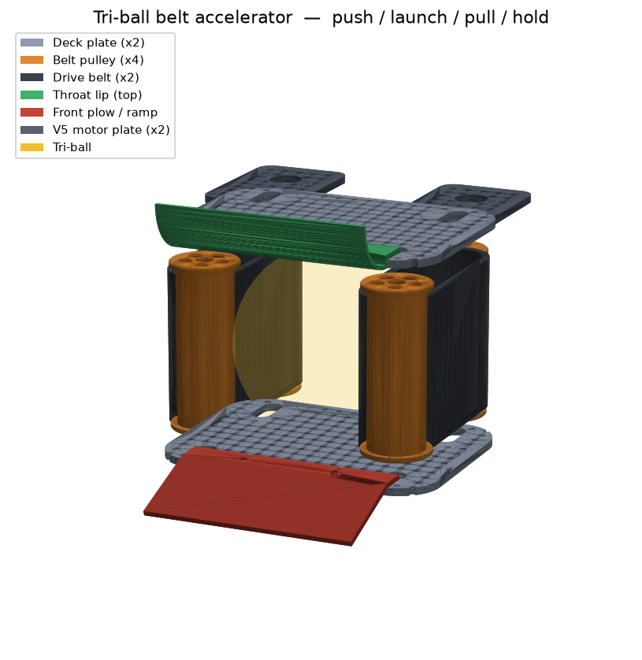

# VEX Tri-Ball Belt Accelerator 🎯

A single VEX mechanism that **pushes, launches, pulls, and holds** a tri-ball —
a **belt accelerator** ("belt railgun"). The ball runs down a barrel gripped
between two motor-driven **conveyor belts** on its left and right (the "rails"),
with **top + bottom decks** containing it and forming the floor it rides on. Like
a railgun it accelerates the ball *along* the barrel — but the rails are traction
belts, and belt **surface speed** is the exit speed. One drive replaces an intake
**and** a puncher **and** a pusher: fewer subsystems, less weight, faster cycles.



## The four modes

| Mode | The belts… | …and the ball |
|------|------------|---------------|
| **PULL** (intake) | run inward, **slow** | friction draws the tri-ball into the barrel |
| **HOLD** (control) | **stopped** | pinched between the belts (compression grip) |
| **LAUNCH** | run outward, **fast** | spun up to belt speed and fired out the muzzle |
| **PUSH** | **off** | drive forward — the front plow shoves it through a contested zone |

Because exit speed ≈ belt surface speed, you set a belt *speed* (not a launch
impulse) and the barrel length does the accelerating — so near/far shots are
repeatable.

## Design basis (first principles)

Sized from four relations, all parametric in [`cad/params.py`](cad/params.py):

| Quantity | Relation | Set by |
|----------|----------|--------|
| Exit speed (no slip) | `v_exit ≈ v_belt = (RPM/60)·π·PULLEY_PITCH_DIA` | pulley Ø + motor RPM (gear-up) |
| Grip (no slip) | `μ·N ≥ m_ball·a` | `BALL_COMPRESSION` (normal force) |
| Channel gap | `BELT_GAP = TRIBALL_DIA − 2·BALL_COMPRESSION` | ball size + squeeze |
| Barrel length | accel distance to reach `v_belt` | `BARREL_LEN` |

Pick `PULLEY_PITCH_DIA` and motor RPM for the exit speed you want,
`BALL_COMPRESSION` for enough grip that the ball doesn't slip, and `BARREL_LEN`
long enough that the ball leaves at (near) belt speed. The side **belts squeeze**
the ball (`BELT_GAP < TRIBALL_DIA`) for grip, while the **top + bottom decks** sit
a hair wider than it (`2·SIDE_INNER_HALF > TRIBALL_DIA`) so it's captured but not
crushed and can't pop out top or bottom.

## Parts

Every part is a **parametric CadQuery script** that exports genuine **STEP**
(Fusion 360 / SolidWorks / FreeCAD / Onshape) and **STL** (ready to slice). The
generated files are committed, so you can open/print without installing anything.

| Part | What it is | Print | Material |
|------|-----------|-------|----------|
| [`belt_pulley`](cad/parts/belt_pulley.py) | Flanged traction pulley, ½" hex bore, lightened | ×4 | PLA/PETG |
| [`drive_belt`](cad/parts/drive_belt.py) | The traction loop the ball rides on — 6 mm thick so the 4 mm squeeze stays inside the belt (rigid ball) | ×2 | TPU 95A (printed — VEXU-legal fabricated part) |
| [`accel_plate`](cad/parts/accel_plate.py) | Grid-perforated deck (top + bottom); 4 vertical pulley bores (rear = tension slots); **flip-symmetric** | ×2 | PLA/PETG |
| [`throat_lip`](cad/parts/throat_lip.py) | Flared TOP mouth guide — bolts to the deck grid, zero aperture intrusion | ×1 | PLA/PETG |
| [`front_plow`](cad/parts/front_plow.py) | Bottom ramp + push blade + bottom mouth guide in one part (chamfered — no step in the ball path) | ×1 | PLA/PETG |
| [`motor_plate`](cad/parts/motor_plate.py) | V5 Smart Motor mount, geared up to a drive-pulley shaft (1.5" centre distance) | ×2 | PLA/PETG |

## Built to the VEX system

- **½" high-strength hex** bores on every pulley (`VEX_HEX_AF`); lock them on with
  shaft collars or the set-screw access hole.
- The **0.5" (12.7 mm) hole grid** fills each deck, so bearing flats, the throat
  lips, the plow, the V5 motors, and the drivetrain C-channel all bolt anywhere.
  The **rear pulley bores are tension slots** — slide the idlers back to tension
  each belt. Holes are **#8-32** clearance (`VEX_HOLE`).
- Sized for the VEX Over-Under **tri-ball** via `TRIBALL_DIA`. Tune
  `PULLEY_PITCH_DIA`, `BARREL_LEN`, `BELT_WIDTH`, `BALL_COMPRESSION`, and
  `SIDE_INNER_HALF` and re-run the export to fit a different element.

> The printed parts are the *custom* geometry (decks, pulleys, throat lips, plow).
> The motors, ½" hex shafts, bearing flats, gears, shaft collars, and the belts
> themselves are stock VEX / COTS — don't print those (print the belts in TPU
> only if you can't source a loop).

## Assembly

1. Snap a VEX **bearing flat** over each of the four pulley bores in each deck
   (front pair fixed; rear pair in the **tension slots**).
2. Stand a **belt pulley** on a **vertical ½" hex shaft** at each corner of the
   barrel — a front + rear pair on the left, a front + rear pair on the right —
   running between the top and bottom decks. Lock with shaft collars / set screws.
3. Loop a **drive belt** around each side's pulley pair (one belt left, one right);
   slide the rear idlers back in their slots to tension.
4. Bolt a **motor plate** on for each belt and gear the **V5 motor** up to that
   side's rear drive pulley (e.g. 12T→36T) for launch belt speed.
5. Bolt the two **throat lips** across the muzzle grid holes — one top, one bottom —
   to flare the mouth.
6. Bolt the **front plow** across the muzzle-floor grid holes — it also ties the two
   decks into a rigid frame.
7. Bolt the whole frame to your drivetrain C-channel through the grid.

## Regenerate the CAD

Edit [`cad/params.py`](cad/params.py), then:

```bash
pip install -r requirements.txt
python -m cad.export_all      # writes cad/{step,stl,previews}
```

## Print settings

- **Structural parts** (decks, pulleys, throat lips, plow): **PETG**, 0.2 mm
  layers, **4 walls**, **40–50 % infill** — these take load and impact.
- **Belts** (only if you can't source a loop): **TPU 95A**, so they flex around
  the pulleys.
- Most parts print support-free in the orientation described in each script's
  docstring. The throat lips overhang mildly — a couple of supports or a
  split-print are fine.

## Layout

```
cad/
  params.py         # ← edit YOUR dimensions here (ball size, belt/pulley sizing)
  parts/*.py        # one parametric script per part
  export_all.py     # regenerate everything + the assembly preview
  lib.py            # STEP/STL export + PNG preview helper
  vexlib.py         # 1/2" hex bore + 0.5" VEX hole-grid helpers
  step/  stl/  previews/   # generated output (committed)
```
